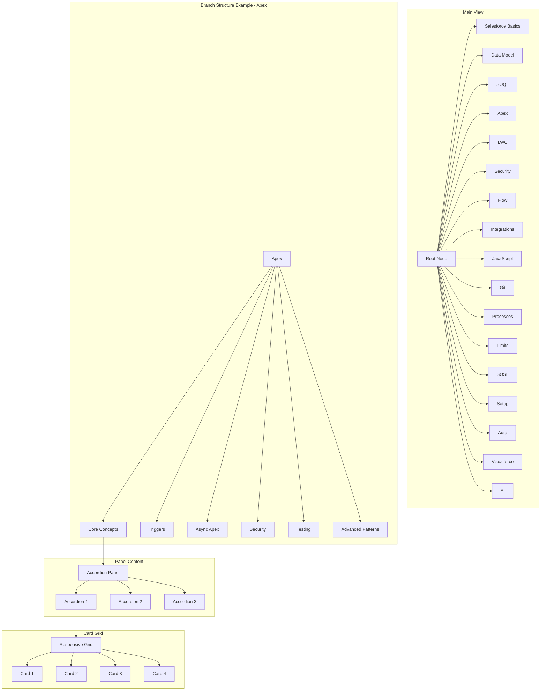
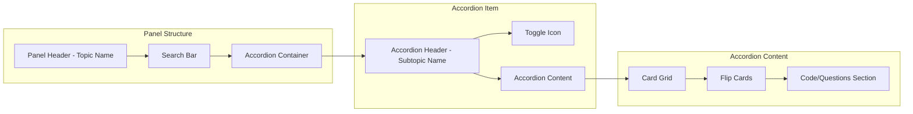
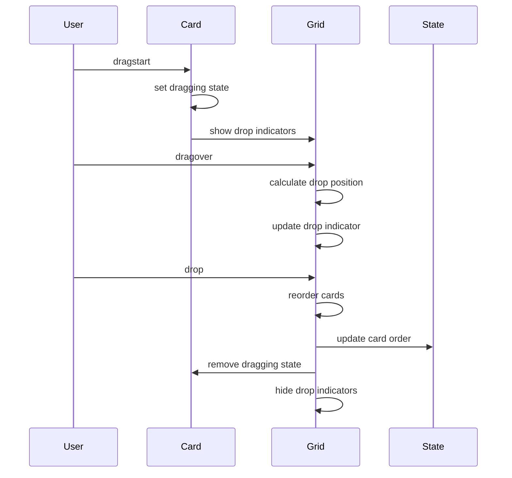

# Salesforce Cheatsheet - Tree Architecture Plan

## Overview
Transform the force-directed graph into a hierarchical tree structure with color-coded branches and accordion-style content panels.

## System Architecture



## Color Schemes per Branch

| Topic ID | Topic Name | Primary Color | Light Theme | Dark Theme |
|----------|------------|---------------|-------------|------------|
| basics | Salesforce Basics | Purple | #8B5CF6 | #A78BFA |
| datamodel | Data Model | Blue | #3B82F6 | #60A5FA |
| soql | SOQL | Sky | #0EA5E9 | #38BDF8 |
| apex | Apex | Orange | #F97316 | #FB923C |
| lwc | LWC | Red | #EF4444 | #F87171 |
| security | Security | Green | #22C55E | #4ADE80 |
| flow | Flow | Violet | #A855F7 | #C084FC |
| integrations | Integrations | Yellow | #EAB308 | #FACC15 |
| javascript | JavaScript | Pink | #EC4899 | #F472B6 |
| git | Git | Teal | #14B8A6 | #2DD4BF |
| processes | Engineering Process | Gray | #6B7280 | #9CA3AF |
| limits | Governor Limits | Indigo | #1E40AF | #3B82F6 |
| sosl | SOSL | Cyan | #06B6D4 | #22D3EE |
| setup | Setup | Slate | #64748B | #94A3B8 |
| aura | Aura Components | Purple | #8B5CF6 | #A78BFA |
| visualforce | Visualforce | Indigo | #6366F1 | #818CF8 |
| ai | AI & Agentforce | Emerald | #10B981 | #34D399 |

## Component Architecture

### 1. Tree Visualization Component
- Replaces D3 force-directed graph
- Hierarchical tree layout (d3.tree or custom implementation)
- Interactive nodes with expand/collapse
- Smooth animations for transitions

### 2. Accordion Panel Component
- Expandable/collapsible sections
- Each subtopic becomes an accordion item
- Maintains state (expanded/collapsed)
- Keyboard accessible

### 3. Card Grid Component
- Responsive grid: `grid-template-columns: repeat(auto-fit, minmax(min(280px, 100%), 1fr))`
- Cards narrower than current (max 280px vs current 180px)
- Flip card functionality preserved
- Drag-and-drop enabled within groups

### 4. Drag-and-Drop System
- HTML5 Drag and Drop API
- Cards draggable within their accordion group
- Visual feedback during drag
- Drop zones between cards
- State persistence (optional)

## Responsive Design Strategy

### Breakpoints
- Mobile: < 768px (1 column)
- Tablet: 768px - 1024px (2 columns)
- Desktop: 1024px - 1440px (3 columns)
- Large: > 1440px (4 columns)

### Typography (clamp-based)
```css
/* Base font sizes */
font-size: clamp(0.75rem, 1.2vw, 0.94rem);  /* ~12-15px */
h1: clamp(1rem, 1.5vw, 1.25rem);
h2: clamp(0.875rem, 1.3vw, 1rem);
h3: clamp(0.75rem, 1.2vw, 0.875rem);
```

### Spacing (clamp-based)
```css
gap: clamp(0.5rem, 1vw, 1rem);
padding: clamp(0.75rem, 1.5vw, 1.25rem);
margin: clamp(0.5rem, 1vw, 1rem);
```

## Data Structure Transformation

### Current (Flat with subtopics)
```javascript
{
  id: "apex",
  label: "Apex",
  subtopics: [
    { name: "Core Concepts", items: [...] },
    { name: "Triggers", items: [...] }
  ]
}
```

### New (Hierarchical Tree)
```javascript
{
  id: "apex",
  label: "Apex",
  color: "orange",
  children: [
    {
      id: "apex-core",
      label: "Core Concepts",
      type: "intermediate",
      content: {
        items: [...],
        tips: [...],
        questions: [...]
      }
    },
    {
      id: "apex-triggers",
      label: "Triggers",
      type: "intermediate",
      content: { ... }
    }
  ]
}
```

## Panel Layout Design



## Drag-and-Drop Flow



## Accessibility Features

1. **Keyboard Navigation**
   - Tab through tree nodes
   - Enter/Space to expand/collapse
   - Arrow keys for tree navigation
   - Escape to close panels

2. **ARIA Attributes**
   - `role="tree"` for tree container
   - `role="treeitem"` for nodes
   - `aria-expanded` for expandable nodes
   - `aria-pressed` for accordion toggles
   - `aria-grabbed` for draggable items

3. **Focus Management**
   - Visible focus indicators
   - Focus trap in panels
   - Focus restoration on close

4. **Screen Reader Support**
   - Descriptive labels
   - Live regions for dynamic content
   - Announcements for state changes

## Implementation Steps

1. **Phase 1: Data Structure Transformation**
   - Convert flat topic structure to hierarchical tree
   - Add color scheme metadata
   - Preserve existing content

2. **Phase 2: Tree Visualization**
   - Replace D3 force simulation with tree layout
   - Implement expand/collapse animations
   - Add color coding per branch

3. **Phase 3: Accordion Panels**
   - Build accordion component
   - Integrate with tree selection
   - Add smooth transitions

4. **Phase 4: Card Grid & Responsive Design**
   - Implement responsive grid system
   - Adjust card dimensions
   - Apply clamp-based sizing

5. **Phase 5: Drag-and-Drop**
   - Implement drag handlers
   - Add drop zones
   - Visual feedback system

6. **Phase 6: Accessibility & Polish**
   - Keyboard navigation
   - ARIA attributes
   - Focus management
   - Testing across devices

## Performance Considerations

1. **Lazy Loading**
   - Load content on demand
   - Virtual scrolling for large lists

2. **Optimized Rendering**
   - Debounced resize handlers
   - RequestAnimationFrame for animations
   - CSS transforms for smooth motion

3. **State Management**
   - Efficient state updates
   - Minimal DOM manipulation
   - Event delegation

## Browser Support

- Chrome/Edge: Latest 2 versions
- Firefox: Latest 2 versions
- Safari: Latest 2 versions
- Mobile browsers: iOS Safari, Chrome Mobile

## Testing Checklist

- [ ] Tree expands/collapses correctly
- [ ] All 17 branches have unique colors
- [ ] Accordion panels open/close smoothly
- [ ] Cards display in responsive grid (1-4 columns)
- [ ] Drag-and-drop works within groups
- [ ] Cannot drag cards outside group
- [ ] Keyboard navigation works
- [ ] Screen reader announces changes
- [ ] No horizontal scroll at any width (320px-2560px)
- [ ] All fonts use clamp() for sizing
- [ ] Focus indicators visible
- [ ] ARIA attributes correct
